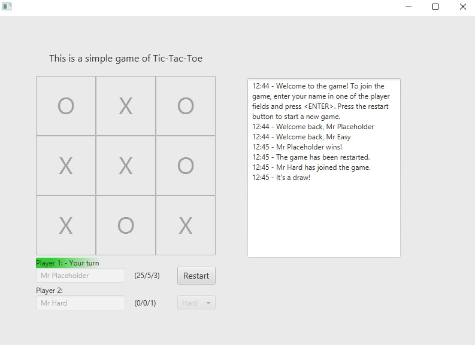

# Brukergrensesnitt
Denne modulen inneholder brukergrensesnittlaget til spillet. Den lar brukeren
spille spillet ved å klikke på ruter med musa, skrive inn brukernavn og velge motspiller.

Brukergrensesnittet er satt opp med et datalag mellom kontroller-klassene
 og selve kjernelogikken. Dette er et grensesnitt (**GameDataAccess**),
 som oversetter forespørsler mellom frontend og backend, slik vi kan bruke
 mest mulig felles kode for ulike versjoner av kontroller-klassen.
 
 Hovedtyngden av frontend-koden ligger i **AbstractController** (en abstrakt klasse),
  som blir utvidet av **LocalController** og **RestController**. Disse er begge JavaFX-apps
  og fungerer i praksis likt, men den første har direkte tilgang på backend
  mens den andre går via et REST API.
  
  
 
 ## Klassediagram
 ```plantuml
 class AbstractController
 class LocalController
 class RestController
 interface GameDataAccess
 class LocalGameDataAccess
 class RestGameDataAccess
 
 AbstractController --> GameDataAccess: "data access"
 LocalController --|> AbstractController
 RestController --|> AbstractController
 
 LocalGameDataAccess ..|> GameDataAccess
 RestGameDataAccess ..|> GameDataAccess
 ```